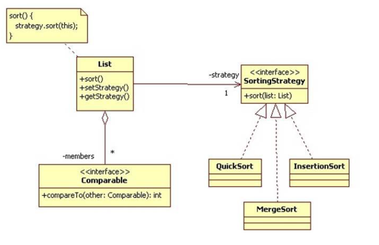

# Strategy design pattern implementation
## The Strategy Design Pattern
The Strategy Design Pattern is a behavioral design pattern that allows algorithms to be selected at runtime based on specific conditions. It is useful in situations where it is necessary to dynamically switch the algorithms used in an application. The pattern provides a way to define a family of algorithms, encapsulate each of them as an object, and make them interchangeable. This pattern allows algorithms to change independently of the clients who use them.

In this project, we have implemented the Strategy Design Pattern to provide clients with the flexibility to choose from four sorting algorithms at runtime. This allows clients to easily swap between sorting algorithms without modifying the existing code. The pattern helps to decouple the clients from the specific sorting algorithms, making the code more modular and easier to maintain.

## Project overview
This project implements the Strategy Design Pattern to enable clients to sort an array of integers using four different sorting algorithms: bubble sort, quick sort, insertion sort, and merge sort. By using the Strategy Design Pattern, the sorting algorithm can be selected at runtime, which provides the flexibility to choose the preferred algorithm dynamically.

## How to Use
To use this project, follow these steps:

- Clone the project from the GitHub repository.
- Import the project into your preferred Java IDE.
- Open the `Test` class and call the `sort` method, passing in an array of integers and the preferred sorting algorithm as a parameter. For example, to sort an array of integers using the bubble sort algorithm:

     `Context context = new Context(new BubbleSort());`

     `context.arrange(new int[] { 5, 2, 9, 1, 5 });`
- Run the project and observe the sorted array as a result.

To add new sorting algorithms, create a new class that implements the `Strategy` interface and override the `sort` method.
